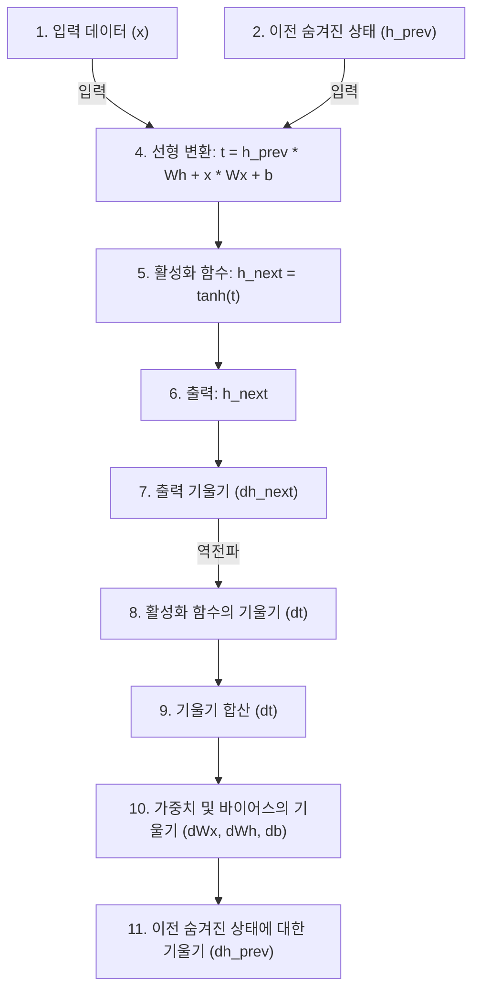

# 순전파 & 역전파 과정

## 순전파 과정
1. **입력 데이터 (`x`)와 이전 숨겨진 상태 (`h_prev`)**:
   - 입력 데이터 `x`는 (1, 4) 크기를 가지며, 이전 숨겨진 상태 `h_prev`는 (1, 3) 크기를 가집니다.

2. **가중치 행렬 및 바이어스**:
   - `Wx` (입력 가중치): (4, 3)
   - `Wh` (숨겨진 상태 가중치): (3, 3)
   - `b` (바이어스): (1, 3)

3. **선형 변환**:
   - \( t = h_{prev} \cdot Wh + x \cdot Wx + b \)
   - 여기서 `MatMul` 노드는 행렬 곱셈을 나타냅니다.

4. **활성화 함수**:
   - \( h_{next} = \tanh(t) \)
   - `tanh` 노드는 하이퍼볼릭 탄젠트 활성화 함수를 나타냅니다.

## 역전파 과정
이미지에서 빨간색 화살표는 역전파 과정을 나타내며, 각 부분의 기울기를 계산하는 과정을 보여줍니다.

1. **출력 기울기 (`dh_next`)**:
   - `dh_next`는 (1, 3) 크기의 행렬입니다. 이는 다음 시간 스텝에서 오는 기울기입니다.

2. **활성화 함수의 기울기**:
   - `tanh` 활성화 함수의 기울기를 계산하여 `dt`를 구합니다.

3. **합산된 기울기 (`dt`)**:
   - `dt`는 `h_prev`, `Wx`, `Wh` 및 `b`에 대한 기울기를 구하기 위한 중간 단계입니다.

4. **가중치와 바이어스에 대한 기울기**:
   - `dWx`: 입력 가중치의 기울기
   - `dWh`: 숨겨진 상태 가중치의 기울기
   - `db`: 바이어스의 기울기

5. **이전 숨겨진 상태에 대한 기울기 (`dh_prev`)**:
   - `dh_prev`는 이전 시간 스텝으로 전달되는 기울기입니다.

### 각 노드의 역할
- **A, B, C**: 가중치 및 바이어스에 대한 기울기를 나타냅니다.
- **D**: 입력 데이터에 대한 기울기입니다.
- **E**: 잠정적인 계산 값 `t`에 대한 기울기입니다.
- **F**: 이전 숨겨진 상태에 대한 기울기입니다.
- **G, H**: 행렬 곱셈을 통해 계산된 값입니다.
- **I, J**: 덧셈 노드로, 각 값들을 합산합니다.
- **K**: 하이퍼볼릭 탄젠트 활성화 함수의 결과입니다.
- **L, M**: 다음 숨겨진 상태 및 그 기울기를 나타냅니다.
- **O**: 기울기의 전파를 나타냅니다.

# Diagram
( Mermaid )

